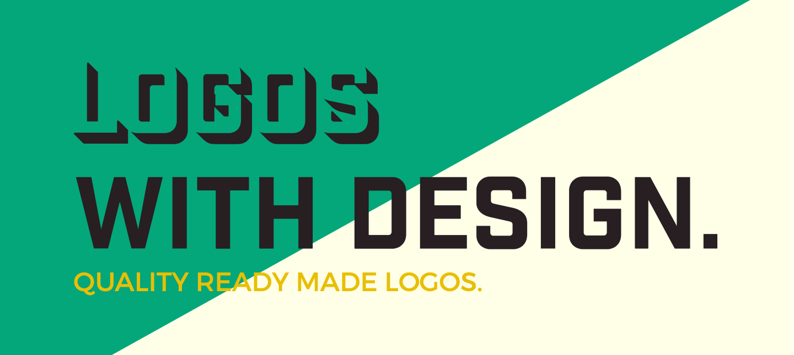
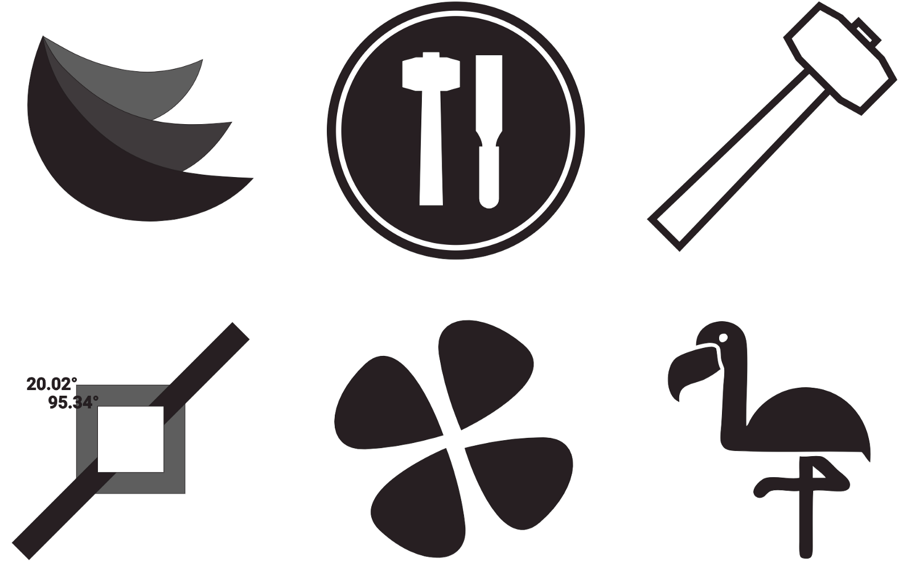

Here at With Design we help many ambitious startups find and reach their hidden brand’s potential. Sometimes we find out that a full brand redesign is required. This includes creating a new logo for the brand.

After helping numerous high achieving startups, we realized that our hard drive were slowly piling up with too many logos that we had not yet used. As our computers were slowing down one day, it dawned on us… we realized that other brands and entrepreneurs could use these logos!

We love open source projects and supporting our community. Today we are proud to announce that we have made our library of unused logos completely free and open source!

Presenting: Logos With Design
Download an free open source logo today! If you like our work, we’d love to work with you to create a completely unique logo with exclusive rights for your brand.

*A sample of logo’s taken from Logos With Design*

View Site
https://logoswithdesign.com

The logos can be downloaded unlimited times and used by anyone. For commercial projects as well as personal projects. We do not require attribution of any sort.

We also have made it available to hire us now specifically for custom logo development. We offer some of the best service features in the industry including: unlimited revisions with flexible fixed pricing decided ahead of time. Each project is professional, high quality, and produced in a timely manner.

This is our way to introduce you to our community, We hope you enjoy!

PS: Be sure to check back from time to time as more and more logos are being added to our open source library daily!

https://logoswithdesign.com
